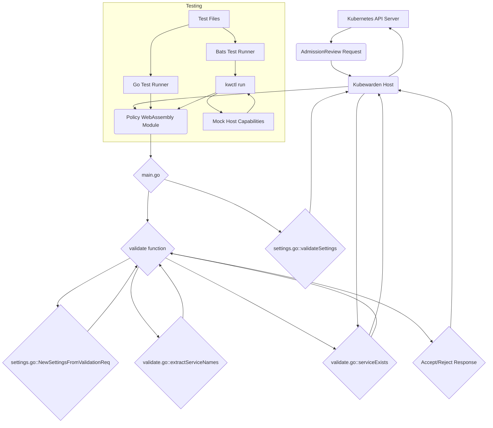

# Kubewarden Deny Ingress No Service 策略开发文档

**1. 项目目的**

本项目是一个 Kubewarden 验证策略，旨在增强 Kubernetes 集群的安全性。其核心目的是确保所有新创建或更新的 Ingress 资源只引用了在同一命名空间中实际存在的 Service。这有助于防止因配置错误或恶意行为导致的流量黑洞或意外的服务暴露。

**2. 架构概览**

该策略采用标准的 Kubewarden 策略结构，基于 Go 语言和 Kubewarden SDK 开发。其主要组件及其交互如下：

策略的核心逻辑位于 `validate.go` 中，通过调用 Host Capabilities 与 Kubernetes 集群交互。`settings.go` 负责处理策略的配置。`main.go` 作为策略的入口点，注册了验证和设置验证函数。测试文件 (`validate_test.go`, `settings_test.go`, `e2e.bats`) 提供了全面的测试覆盖。

**3. 核心逻辑 (`validate.go`)**

*   **`validate(payload []byte) ([]byte, error)`**:
    *   策略接收到验证请求后执行的主函数。
    *   反序列化 `payload` 为 `ValidationRequest`。
    *   解析策略设置 (`Settings`)。
    *   反序列化请求中的资源对象为 `networkingv1.Ingress`。
    *   如果设置中禁用了 Service 检查，则直接接受请求。
    *   提取 Ingress 中引用的所有 Service 名称。
    *   遍历 Service 名称，调用 `serviceExists` 检查每个 Service。
    *   根据检查结果返回接受或拒绝的响应。

*   **`serviceExists(ingress *networkingv1.Ingress, settings Settings, serviceName string) (bool, error)`**:
    *   检查指定 Service 是否存在。
    *   构造 Host Capabilities 请求，使用 `kubernetes` capability 的 `get_resource` 操作。
    *   请求参数包括 `api_version` ("v1")、`kind` ("Service")、`namespace` (从 Ingress 对象获取)、`name` (Service 名称) 和 `disable_cache` (从策略设置获取)。
    *   通过 `host.Client.HostCall` 发送请求。
    *   根据 Host Call 的响应判断 Service 是否存在（非空响应表示存在，包含 "not found" 错误的响应表示不存在）。

*   **`getIngress(rawJSON json.RawMessage) (*networkingv1.Ingress, error)`**: 辅助函数，反序列化 Ingress 对象。
*   **`extractServiceNames(ing *networkingv1.Ingress) []string`**: 辅助函数，提取并去重 Ingress 引用的 Service 名称。

**4. 策略设置 (`settings.go`)**

*   **`Settings` 结构体**: 定义策略配置字段 (`EnforceServiceExists`, `DisableCache`)。
*   **`IncomingSettings` 结构体**: 用于解析嵌套的设置格式。
*   **`NewSettingsFromValidationReq(validationReq *kubewarden_protocol.ValidationRequest) (Settings, error)`**: 从 `ValidationRequest` 解析设置，支持扁平结构和嵌套 `signatures` 结构，并应用默认值。
*   **`Valid() (bool, error)`**: 校验设置合法性（当前总是返回 true）。
*   **`IsEnforcementEnabled() bool`**: 检查是否启用 Service 检查。
*   **`validateSettings(payload []byte) ([]byte, error)`**: 策略加载时由 Host 调用，验证设置格式。

**5. 测试策略**

项目包含全面的测试：

*   **单元测试 (`validate_test.go`, `settings_test.go`)**:
    *   使用 Go 的内置测试框架。
    *   `validate_test.go` 使用 `mockWapcClient` 模拟 Host Capabilities，测试 `validate` 和 `serviceExists` 的逻辑。
    *   `settings_test.go` 测试设置解析函数 `NewSettingsFromValidationReq` 和 `validateSettings`。
    *   运行方式：`make test`。

*   **端到端测试 (`e2e.bats`)**:
    *   使用 Bats 框架编写。
    *   通过 `kwctl run` 执行策略，并使用 `--replay-host-capabilities-interactions` 参数和 mock 文件模拟 Host Capabilities 响应。
    *   测试覆盖不同场景下的策略行为（Service 存在/不存在，验证启用/禁用，空 Ingress）。
    *   运行方式：`make e2e-tests`。

**6. 构建和运行**

*   使用 `Makefile` 管理构建和测试流程。
*   `make policy.wasm`: 使用 TinyGo 构建 Go 源码为 WebAssembly 模块。
*   `make annotated-policy.wasm`: 使用 `kwctl annotate` 将 `metadata.yml` 和 `README.md` 添加到 wasm 模块中，生成最终策略文件。
*   `make test`: 运行单元测试。
*   `make e2e-tests`: 运行端到端测试。
*   `make lint`, `make lint-fix`: 运行 Go 代码静态分析。
*   `make clean`: 清理生成文件。
*   `make fmt`: 格式化 Go 代码。

**7. 元数据 (`metadata.yml`)**

*   定义策略适用的 Kubernetes 资源和操作 (`rules`)。
*   指定策略是验证策略 (`mutating: false`)。
*   声明策略需要上下文感知能力 (`contextAware: true`) 并列出需要访问的资源类型 (`contextAwareResources`: Namespace, Service)。
*   定义执行模式 (`executionMode: kubewarden-wapc`)。
*   包含用于 Artifact Hub 和 Kubewarden 的注解信息（如显示名称、描述、作者、OCI URL、严重性、类别等）。
